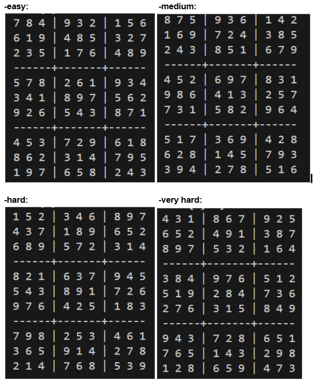

# Constraint-Satisfaction-Problems
Assignment 2 from course TDT4136- Introduction to AI - NTNU 2025/2026

## 1. Introduction
The purpose of this assignment was to solve four Sudoku puzzles of increasing difficulty (easy, medium, hard, very hard) by modeling them as Constraint Satisfaction Problems. A CSP framework provides a natural way of representing Sudoku, where each cell is treated as a variable, its possible digits form the domain, and the Sudoku rules are expressed as binary constraints.  

The assignment required the implementation of:
- **AC-3**, used as a preprocessing step to reduce domains before search  
- **Backtracking search**, which explores possible assignments recursively until a solution is found  

The provided code handout contained a skeleton implementation of the CSP class (`csp.py`) and the Sudoku setup (`sudoku.py`). The task was to complete the missing parts and run the algorithms to obtain:
- The solutions to the puzzles  
- The domains after AC-3  
- Backtracking statistics (calls and failures)  
- Runtimes for backtracking and for the overall process (AC-3 + backtracking)  

---

## 2. Implementation Notes
The code handout provided already included the structure of the CSP class and the Sudoku setup, but several parts needed to be completed in order to solve the puzzles. The main tasks were to implement the AC-3 algorithm and the backtracking search method. Both functions were added in `csp.py`, following the pseudocode from *Artificial Intelligence: A Modern Approach (AIMA, 4th edition)*.  

While working on the implementation, we identified an issue in the way binary constraints were initialized in the CSP constructor. In the original code, both `(value1, value2)` and `(value2, value1)` pairs were stored under the same key `(variable1, variable2)`. This mixed the two directions of the constraint, which caused the AC-3 algorithm to remove values incorrectly and left some domains empty (e.g., `X12 = set()` in the easy Sudoku). As a result, AC-3 returned `False` and no solution could be found.  

We resolved this problem by modifying the initialization so that constraints are stored in both directions separately: `(value1, value2)` is saved under the key `(variable1, variable2)`, while `(value2, value1)` is saved under the key `(variable2, variable1)`. In this way, each arc is represented correctly and AC-3 works as intended.  

In addition, to be able to produce the statistics required in the assignment, counters were introduced to record how many times the `backtrack()` function was called and how many times it returned failure. Also runtime measurements were added around the AC-3 preprocessing and the backtracking search, in order to report both the runtime of backtracking alone and the total runtime (AC-3 + backtracking).  

---

## 3. Results

### 3.1 Sudoku Solutions
Each puzzle (easy, medium, hard, very hard) was solved successfully, and the completed boards are shown below:

---

### 3.2 Domains after AC-3
Before running backtracking, the AC-3 algorithm was applied to enforce arc consistency and reduce the variable domains.  

In the output, each variable is labelled according to its position in the Sudoku grid (e.g., `X11` refers to the cell in row 1, column 1). The set that follows indicates the remaining possible values for that cell after AC-3. For instance, `X11 {7}` means that cell (1,1) can only take the value 7, while `X11 {2, 5, 8}` would mean that cell (1,1) could still be any of 2, 5, or 8.  

- **easy:**  
Domains after AC-3:
  - X11 {7}
  - X11 {7}
  - X12 {8}
  - X13 {4}
  - X14 {9}
  - X15 {3}
  - X16 {2}
  - X17 {1}
  - X18 {5}
  - X19 {6}
  - X21 {6}
  - X22 {1}
  - X23 {9}
  - X24 {4}
  - X25 {8}
  - X26 {5}
  - X27 {3}
  - X28 {2}
  - X29 {7}
  - X31 {2}
  - X32 {3}
  - X33 {5}
  - X34 {1}
  - X35 {7}
  - X36 {6}
  - X37 {4}
  - X38 {8}
  - X39 {9}
  - X41 {5}
  - X42 {7}
  - X43 {8}
  - X44 {2}
  - X45 {6}
  - X46 {1}
  - X47 {9}
  - X48 {3}
  - X49 {4}
  - X51 {3}
  - X52 {4}
  - X53 {1}
  - X54 {8}
  - X55 {9}
  - X56 {7}
  - X57 {5}
  - X58 {6}
  - X59 {2}
  - X61 {9}
  - X62 {2}
  - X63 {6}
  - X64 {5}
  - X65 {4}
  - X66 {3}
  - X67 {8}
  - X68 {7}
  - X69 {1}
  - X71 {4}
  - X72 {5}
  - X73 {3}
  - X74 {7}
  - X75 {2}
  - X76 {9}
  - X77 {6}
  - X78 {1}
  - X79 {8}
  - X81 {8}
  - X82 {6}
  - X83 {2}
  - X84 {3}
  - X85 {1}
  - X86 {4}
  - X87 {7}
  - X88 {9}
  - X89 {5}
  - X91 {1}
  - X92 {9}
  - X93 {7}
  - X94 {6}
  - X95 {5}
  - X96 {8}
  - X97 {2}
  - X98 {4}
  - X99 {3}

- **medium:**  
Domains after AC-3:
  - X11 {2, 5, 8}
  - X12 {2, 5, 7}
  - X13 {5, 7}
  - X14 {9}
  - X15 {3}
  - X16 {6}
  - X17 {1, 5}
  - X18 {4}
  - X19 {2, 5}
  - X21 {1}
  - X22 {5, 6}
  - X23 {9}
  - X24 {7}
  - X25 {2}
  - X26 {4}
  - X27 {3, 5, 6}
  - X28 {8}
  - X29 {5, 6}
  - X31 {2, 3, 4, 6}
  - X32 {2, 4, 6}
  - X33 {3, 4}
  - X34 {8}
  - X35 {5}
  - X36 {1}
  - X37 {3, 6}
  - X38 {7}
  - X39 {2, 6, 9}
  - X41 {4, 5}
  - X42 {4, 5}
  - X43 {2}
  - X44 {6}
  - X45 {9}
  - X46 {7}
  - X47 {8}
  - X48 {3}
  - X49 {1}
  - X51 {9}
  - X52 {8}
  - X53 {6}
  - X54 {4}
  - X55 {1}
  - X56 {3}
  - X57 {2}
  - X58 {5}
  - X59 {7}
  - X61 {7}
  - X62 {3}
  - X63 {1}
  - X64 {5}
  - X65 {8}
  - X66 {2}
  - X67 {9}
  - X68 {6}
  - X69 {4}
  - X71 {4, 5}
  - X72 {1}
  - X73 {4, 5, 7}
  - X74 {3}
  - X75 {6}
  - X76 {9}
  - X77 {4, 5}
  - X78 {2}
  - X79 {5, 8}
  - X81 {2, 6}
  - X82 {2, 6}
  - X83 {8}
  - X84 {1}
  - X85 {4}
  - X86 {5}
  - X87 {7}
  - X88 {9}
  - X89 {3}
  - X91 {3, 4, 5, 6}
  - X92 {9}
  - X93 {3, 4, 5}
  - X94 {2}
  - X95 {7}
  - X96 {8}
  - X97 {4, 5, 6}
  - X98 {1}
  - X99 {5, 6}

- **hard:**  
Domains after AC-3:
  - X11 {1}
  - X12 {3, 5, 6, 8}
  - X13 {2}
  - X14 {3, 9}
  - X15 {4}
  - X16 {6, 9}
  - X17 {6, 8}
  - X18 {5, 6, 8, 9}
  - X19 {7}
  - X21 {3, 4, 6}
  - X22 {3, 5, 6, 7}
  - X23 {3, 4, 5, 7}
  - X24 {1, 2, 3, 7, 9}
  - X25 {8}
  - X26 {1, 2, 6, 9}
  - X27 {1, 2, 6}
  - X28 {1, 5, 6, 9}
  - X29 {1, 2, 5}
  - X31 {6, 8}
  - X32 {6, 7, 8}
  - X33 {9}
  - X34 {5}
  - X35 {2, 7}
  - X36 {1, 2, 6}
  - X37 {3}
  - X38 {1, 6, 8}
  - X39 {4}
  - X41 {3, 8}
  - X42 {1, 2, 3, 8}
  - X43 {1, 3}
  - X44 {6}
  - X45 {2, 3}
  - X46 {7}
  - X47 {9}
  - X48 {1, 3, 4, 5, 8}
  - X49 {1, 3, 5, 8}
  - X51 {5}
  - X52 {4}
  - X53 {1, 3, 7}
  - X54 {1, 3, 8, 9}
  - X55 {3, 9}
  - X56 {1, 8, 9}
  - X57 {1, 7, 8}
  - X58 {2}
  - X59 {6}
  - X61 {3, 8, 9}
  - X62 {1, 2, 3, 7, 8, 9}
  - X63 {6}
  - X64 {4}
  - X65 {2, 3, 9}
  - X66 {5}
  - X67 {1, 7, 8}
  - X68 {1, 3, 7, 8}
  - X69 {1, 3, 8}
  - X71 {7}
  - X72 {1, 5, 6, 9}
  - X73 {8}
  - X74 {2, 9}
  - X75 {2, 5, 9}
  - X76 {3}
  - X77 {4}
  - X78 {1, 6}
  - X79 {1, 2}
  - X81 {3, 4, 6, 9}
  - X82 {3, 5, 6, 9}
  - X83 {3, 4, 5}
  - X84 {2, 7, 8, 9}
  - X85 {1}
  - X86 {2, 4, 8, 9}
  - X87 {2, 6, 7, 8}
  - X88 {3, 6, 7, 8}
  - X89 {2, 3, 8}
  - X91 {2}
  - X92 {1, 3}
  - X93 {1, 3, 4}
  - X94 {7, 8}
  - X95 {6}
  - X96 {4, 8}
  - X97 {5}
  - X98 {1, 3, 7, 8}
  - X99 {9}

- **very hard:**  
Domains after AC-3:
  - X11 {4, 5, 8, 9}
  - X12 {2, 3, 4, 5, 9}
  - X13 {1}
  - X14 {2, 5, 6, 8, 9}
  - X15 {5, 6, 8, 9}
  - X16 {7}
  - X17 {5, 8, 9}
  - X18 {2, 8, 9}
  - X19 {2, 5, 8, 9}
  - X21 {6}
  - X22 {2, 5, 9}
  - X23 {2, 5, 7, 9}
  - X24 {4}
  - X25 {5, 8, 9}
  - X26 {1, 2, 8}
  - X27 {3}
  - X28 {1, 2, 7, 8, 9}
  - X29 {2, 5, 7, 8, 9}
  - X31 {5, 8, 9}
  - X32 {2, 5, 9}
  - X33 {2, 5, 7, 9}
  - X34 {2, 5, 8, 9}
  - X35 {3}
  - X36 {1, 2, 8}
  - X37 {1, 5, 7, 8, 9}
  - X38 {6}
  - X39 {4}
  - X41 {3}
  - X42 {8}
  - X43 {4, 5, 9}
  - X44 {2, 9}
  - X45 {7}
  - X46 {6}
  - X47 {1, 4, 5, 9}
  - X48 {1, 2, 4, 9}
  - X49 {2, 5, 9}
  - X51 {1, 4, 5, 9}
  - X52 {1, 4, 5, 9}
  - X53 {4, 5, 9}
  - X54 {2, 8, 9}
  - X55 {4, 8, 9}
  - X56 {2, 4, 8}
  - X57 {1, 4, 5, 7, 8, 9}
  - X58 {3}
  - X59 {6}
  - X61 {2}
  - X62 {7}
  - X63 {4, 6, 9}
  - X64 {3, 8, 9}
  - X65 {1}
  - X66 {5}
  - X67 {4, 8, 9}
  - X68 {4, 8, 9}
  - X69 {8, 9}
  - X71 {4, 9}
  - X72 {3, 4, 6, 9}
  - X73 {3, 4, 6, 9}
  - X74 {3, 6, 7, 8}
  - X75 {2}
  - X76 {3, 4, 8}
  - X77 {4, 6, 7, 8, 9}
  - X78 {5}
  - X79 {1}
  - X81 {7}
  - X82 {3, 4, 5, 6, 9}
  - X83 {3, 4, 5, 6, 9}
  - X84 {1}
  - X85 {4, 5, 6, 8}
  - X86 {3, 4, 8}
  - X87 {2}
  - X88 {4, 8, 9}
  - X89 {3, 8, 9}
  - X91 {1, 4, 5}
  - X92 {1, 2, 3, 4, 5, 6}
  - X93 {8}
  - X94 {3, 5, 6, 7}
  - X96 {9}
  - X97 {4, 6, 7}
  - X98 {4, 7}
  - X99 {3, 7}

---

### 3.3 Backtracking Statistics
Two backtracking statistics were recorded: the total number of recursive calls to the `backtrack()` function, and the number of times backtracking returned a failure.

- **easy:**  
Backtrack calls: 82  
Backtrack failures: 0  

- **medium:**  
Backtrack calls: 273  
Backtrack failures: 191  

- **hard:**  
Backtrack calls: 1288  
Backtrack failures: 1206  

- **very hard:**  
Backtrack calls: 14382  
Backtrack failures: 14300  

---

### 3.4 Backtracking Runtime
The runtime of the backtracking search was measured separately by recording the time just before the search started and right after it finished. This value represents only the cost of the backtracking phase, without including the time spent on AC-3 preprocessing.  

- **easy:** 0.0119 seconds  
- **medium:** 0.0446 seconds  
- **hard:** 0.3262 seconds  
- **very hard:** 3.9622 seconds  

---

### 3.5 Total Runtime (AC-3 + Backtracking)
Finally, the total runtime was measured by including both the AC-3 preprocessing and the backtracking search. This provides a complete picture of the time required to solve each Sudoku board from start to finish.  

- **easy:** 0.1298 seconds  
- **medium:** 0.1498 seconds  
- **hard:** 0.4399 seconds  
- **very hard:** 4.0699 seconds  

---

## 4. Discussion
This project clearly shows the impact of AC-3 on the search process. For the easy and medium boards, AC-3 was able to drastically reduce the variable domains before search, leaving many cells with a single possible value. This preprocessing step simplified the problem to the point where backtracking required only limited exploration. In the easy puzzle, for example, the solution was almost deterministic, with 82 calls and no failures, and the runtime was almost instantaneous. The medium puzzle also remained manageable, with moderate runtimes that reflected a limited but non-trivial amount of search.  

However, for harder puzzles AC-3 alone was not sufficient. While it still removed some inconsistent values, many domains remained large and ambiguous, leaving the backtracking algorithm to explore a huge number of possibilities. As a result, both runtime and the number of failures increased significantly. The very-hard puzzle clearly demonstrated the exponential nature of the problem, with over 14,000 backtrack calls and almost as many failures, as well as runtimes that were much higher compared to the easy and medium boards. This growth illustrates how preprocessing can reduce but not eliminate the inherent complexity of CSPs.  

These findings also suggest possible improvements. Heuristics such as **MRV (Minimum Remaining Values)** could significantly improve efficiency by always selecting the variable with the fewest legal values left. By prioritizing the hardest choices, the algorithm reduces the risk of making a wrong assignment late in the process, thereby cutting down the depth of search.  

Similarly, the **LCV (Least Constraining Value)** heuristic could be applied when choosing a value for a variable. Instead of picking values arbitrarily, LCV selects the option that rules out the fewest values in neighboring variables. This strategy helps keep domains flexible and reduces the likelihood of conflicts later in the search.  

Adding inference techniques such as **forward checking** would further strengthen the solver. Forward checking immediately removes inconsistent values from the domains of unassigned variables whenever a new assignment is made. This allows the algorithm to detect dead ends earlier, often avoiding large amounts of wasted exploration.  

More generally, the results highlight the trade-off between **preprocessing** (such as AC-3) and **search** (backtracking): while preprocessing can significantly reduce the search space, it cannot fully replace the need for efficient search strategies in difficult cases.  
